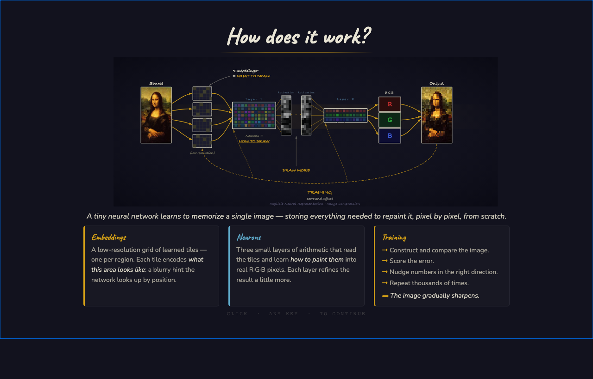

# Neural Image Compression

A browser-based tool that compresses images using **Implicit Neural Representations** (INR).
A tiny neural network — embeddings + a 3-layer MLP — is trained entirely in WebGPU to
memorize a single image. The result can be exported as a standalone GLSL shader.

## How it works

The network has two components:

- **Embeddings** — a low-resolution spatial grid. Each cell stores a learned
  hint describing what that region of the image looks like.
- **MLP (neurons)** — three small arithmetic layers that read the embedding
  at each pixel coordinate and output an R·G·B color.

Training runs a forward pass, computes pixel error, and back-propagates
gradients with the Adam optimizer — all in WGSL compute shaders.
After a few thousand steps the network can reconstruct the image from scratch.

## Features

- Full GPU pipeline: forward pass, backward pass, and Adam optimizer in WGSL
- 8-bit or 4-bit packed embeddings (QAT)
- Per-plane UV offsets for higher effective resolution
- Live loss curve, embedding grid, and layer weight visualizations
- Export trained model to GLSL shader (ShaderToy-compatible)
- Save / load as `.safetensors` (weights + UI settings in metadata)
- Drag-and-drop `.safetensors` to run inference without retraining

## Usage

Open `index.html` in a browser with WebGPU support (Chrome 113+, Edge 113+).
Drop an image onto the SOURCE panel, adjust settings, and press **Train**.

