<h1 align="center"><a href="./MASSIMINO_Pascal_Resume.pdf">Skal</a>'s corner — code snippets &amp; demos</h1>

My day-job is — amongst other things — writing open-sourced code (like
[webp](https://github.com/webmproject/libwebp) or
[sjpeg](https://github.com/webmproject/sjpeg)).
But! I also write open-sourced code *for fun* :) &nbsp; Here are some side-project demos.

## Recent

<table>
<tr>
<td width="33%" align="center" valign="top">
<a href="https://skal65535.github.io/NNC/index.html">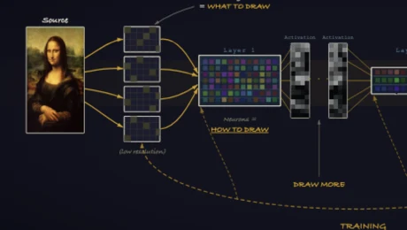</a> 
<b><a href="https://skal65535.github.io/NNC/index.html">Instant-NGP — in-browser training</a></b> 
Neural-net compression: an online Adam trainer for embeddings + MLP that
learns both an image's representation and its reconstruction.
</td>
<td width="33%" align="center" valign="top">
<a href="https://skal65535.github.io/splats/index.html">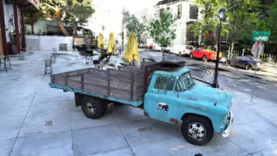</a> 
<b><a href="https://skal65535.github.io/splats/index.html">Gaussian splats (3DGS)</a></b> 
The new cool in scene rendering — my WebGPU version, and a good excuse to
play with GPU compute passes.
</td>
<td width="33%" align="center" valign="top">
<a href="https://skal65535.github.io/SNL/index.html">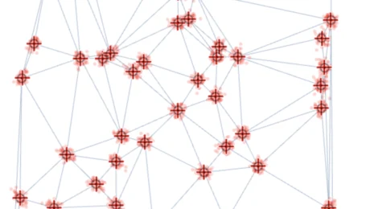</a> 
<b><a href="https://skal65535.github.io/SNL/index.html">Sensor Network Localization</a></b> 
Recover a network's geometry from noisy pairwise distances (MDS / gradient
descent), with Monte-Carlo uncertainty and a rigidity phase transition.
</td>
</tr>
</table>

## Demos & experiments

<table>
<tr>
<td width="33%" align="center" valign="top">
<a href="https://skal65535.github.io/trisoup/index.html">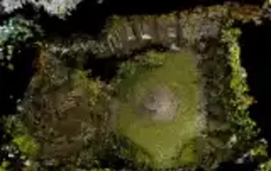</a> 
<b><a href="https://skal65535.github.io/trisoup/index.html">Triangle splats</a></b> 
The triangle cousin of 3DGS, in WebGPU.
</td>
<td width="33%" align="center" valign="top">
<a href="https://skal65535.github.io/BVH/index.html">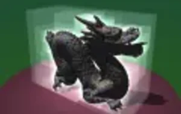</a> 
<b><a href="https://skal65535.github.io/BVH/index.html">Bounding Volume Hierarchy</a></b> 
Pre-sort a mesh's triangles nicely and get a BVH at zero memory cost.
</td>
<td width="33%" align="center" valign="top">
<a href="https://skal65535.github.io/ising/index.html">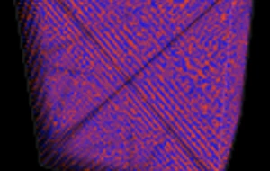</a> 
<b><a href="https://skal65535.github.io/ising/index.html">Ising model</a></b> 
3D cubic Ising spins via WebGPU compute — Metropolis Monte-Carlo at
interactive framerate.
</td>
</tr>
<tr>
<td width="33%" align="center" valign="top">
<a href="https://skal65535.github.io/curl/index.html?funky">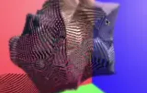</a> 
<b><a href="https://skal65535.github.io/curl/index.html?funky">Curly thing</a></b> 
Dynamic tessellation in a compute pass — demomaker-ish WebGPU fun.
</td>
<td width="33%" align="center" valign="top">
<a href="https://skal65535.github.io/stipple/index.html">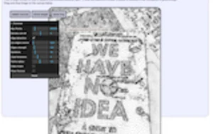</a> 
<b><a href="https://skal65535.github.io/stipple/index.html">Stippling toy</a></b> 
LBG / Lloyd algorithm in live action, with lots of knobs to play with.
</td>
<td width="33%" align="center" valign="top">
<a href="https://skal65535.github.io/dog/dog.html">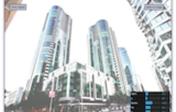</a> 
<b><a href="https://skal65535.github.io/dog/dog.html">Difference of Gaussian</a></b> 
Play with all the <a href="https://users.cs.northwestern.edu/~sco590/winnemoeller-cag2012.pdf">DoG</a>
parameters, in WebGL.
</td>
</tr>
<tr>
<td width="33%" align="center" valign="top">
<a href="https://skal65535.github.io/tree/index.html">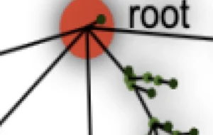</a> 
<b><a href="https://skal65535.github.io/tree/index.html">Tree roots</a></b> 
The root of a tree isn't <i>that</i> special — pick any node as the root.
</td>
<td width="33%" align="center" valign="top">
 
<b><a href="https://skal65535.github.io/thinning/index.html">Thinning</a></b> 
Two algorithms that extract skeletons from binarized images.
</td>
<td width="33%" align="center" valign="top">
<a href="https://skal65535.github.io/QR">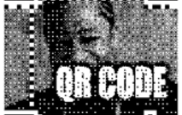</a> 
<b><a href="https://skal65535.github.io/QR">QR code generator</a></b> 
Embed pictures inside QR codes.
</td>
</tr>
<tr>
<td width="33%" align="center" valign="top">
<a href="https://skal65535.github.io/CVM">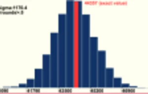</a> 
<b><a href="https://skal65535.github.io/CVM">CVM algorithm</a></b> 
Animated online <a href="https://en.wikipedia.org/wiki/Count-distinct_problem#CVM_Algorithm">estimate</a>
of the number of distinct elements in a stream.
</td>
<td width="33%" align="center" valign="top">
<a href="https://skal65535.github.io/triangle/index.html">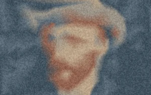</a> 
<b><a href="https://skal65535.github.io/triangle/index.html">Triangle compression</a></b> 
Triangulation + colormap → a tiny base64 image preview
(<a href="http://arxiv.org/abs/1809.02257">ICIP 2018</a>).
</td>
<td width="33%" align="center" valign="top">
<a href="https://skal65535.github.io/triangle/encoder.html">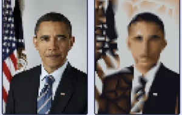</a> 
<b><a href="https://skal65535.github.io/triangle/encoder.html">Triangle encoder</a></b> 
The pure-JS optimizer behind it — paste its base64 output into the
<a href="https://skal65535.github.io/triangle/index.html">decoder</a> to render.
</td>
</tr>
<tr>
<td width="33%" align="center" valign="top">
<a href="https://skal65535.github.io/convex_hull/index.html">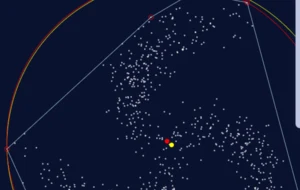</a> 
<b><a href="https://skal65535.github.io/convex_hull/index.html">Welzl's algorithm</a></b> 
Convex hull + smallest enclosing circle (2D). The interest is the code.
</td>
<td width="33%" align="center" valign="top">
<a href="https://skal65535.github.io/network/kruskal.html">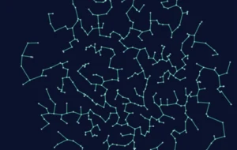</a> 
<b><a href="https://skal65535.github.io/network/kruskal.html">Kruskal's algorithm</a></b> 
A simple, elegant Minimum-Spanning-Tree extraction from a point set.
</td>
<td width="33%" align="center" valign="top">
<a href="https://skal65535.github.io/particle_life/#91651088029">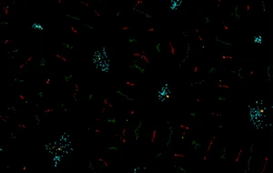</a> 
<b><a href="https://skal65535.github.io/particle_life/#91651088029">Particle Life</a></b> 
Randomly interacting particles — hit <i>Random exploration</i> for fun.
</td>
</tr>
</table>

## Shaders & tools

[**Minishader**](https://skal65535.github.io/minishader/index.html) converts simple
ShaderToy code into a standalone HTML + WebGL page. A few shaders made along the way:

<table>
<tr>
<td valign="middle">
<ul>
<li><a href="https://www.shadertoy.com/view/ftByDD">Voronoi experiments</a></li>
<li><a href="https://www.shadertoy.com/view/ft2czK">Fluid flow simulation</a></li>
<li><a href="https://www.shadertoy.com/view/stcBDB">Group Velocity visualization</a></li>
<li><a href="https://www.shadertoy.com/view/slKfWR">Mach cone visualization</a></li>
<li><a href="https://www.shadertoy.com/view/stGBWh">Kelvin wake visualization</a></li>
<li><a href="https://www.shadertoy.com/view/NlyfRV">Rainbow visualization</a></li>
<li><a href="https://www.shadertoy.com/view/slKfWc">Deluge Simulator</a></li>
</ul>
</td>
<td valign="middle" align="center">
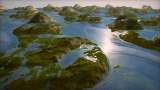
</td>
</tr>
</table>

## Hardware

A custom [MPU9255 Gyro / AK8963 Magnetometer / MCP2221](https://github.com/skal65535/sklmpu9255)
library: I couldn't find one for this IMU, so I rewrote it — plus some I2C routines for the
MCP2221 USB↔I2C micro, so I can play with the IMU straight from my MacBook (no more Raspberry Pi!).
